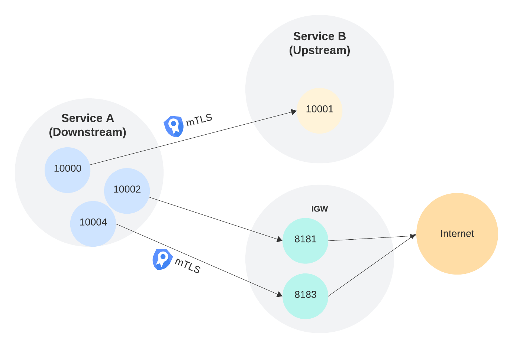

# envoy-mtls-poc

mTLS setup POC using envoy proxy

Setup:

Steps:

1. Follow instructions in https://openssl-ca.readthedocs.io/en/latest/create-the-root-pair.html to create your own root CA, intermediate CA, server cert and client cert. also need to update macos keychain to trust the intermediate ca.
1. Make sure you have envoy installed.
1. Test service to service mTLS:
   - spin up downstream service: `envoy -c service_a.yaml --log-level debug`
   - spin up upstream service: `envoy -c service_b.yaml --log-level debug`
   - It is configured that `service_a` port `10000` is routing to `service_b` port `10001`. `service_a` has been configured to attach client cert, and `service_b` has been configured with server cert, plus require and verify client cert.
   - `curl -vvv  http://localhost:10000`. For curl, you should see 200 with the expected output. In both `service_a` and `service_b` envoy logs, you should be able to see `Async cert validation completed`. This should mean that mTLS is established.
1. Test service to IGW mTLS:
   - spin up downstream service: `envoy -c service_a.yaml --log-level debug`
   - spin up internet gateway: `envoy -c igw.yaml --log-level debug`
   - It is configured that `service_a` port `10002` is routing to `igw` port `8181` which does not require TLS.
   - `curl -v -H "Host: www.google.com" http://localhost:10002`.
     - this is a simple http proxy from curl, to downstream service, to IGW.
   - It is congiured that `service_a` port `10004` is routing to `igw` port `8183` which requires mTLS.
     - `curl -v -H "Host: www.google.com" http://localhost:10004`
     - 10004 is 'proxied' through 8183 which is IGW. IGW is configured to attach client cert in the header.
