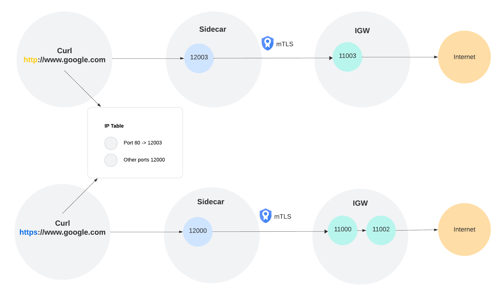

## TProxy POC

## Pre-requisites


1. Since T-proxy requires iptable changes, it's better to do it in a clean/standalone linux machine. In my setup, I spinned up an EC2 with [Debian 12](https://aws.amazon.com/marketplace/pp/prodview-g5rooj5oqzrw4) AMI.
1. SSH into the EC2 instance, and install envoy.
1. To have envoy, curl and iptable work properly, we will need a new group and a new user.

    ```
    sudo groupadd -g <GID> <groupname>
    sudo useradd -u <UID> -g <groupname> -m <username>
    ```
    Choose a GID and UID that is not `1000` which is the default root user/group id. We will use the root user uid==gid==1000 to run Envoy, and will use the new user with a diff uid/gid to run `curl`. The `curl` and the new `user` is simulating the `service container`.

1. Touch new files to copy the envoy configs. 
1. scp both client and server ca certs/certificates/keys to the EC2, remember to change the directory to the cert/keys in the configs. 

## Setup

1. Modify IP Table.Create a new NAT chain `ENVOY_EGRESS`. Exclude root uid/gid from it, exclude local internal traffic, then redirect port 80 traffic to port `12003`, redirect all other traffic to port `12000`. 

1. spin up all 3 envoy instances - 2 for IGW and 1 for sidecar. In real world there might be just one IGW with different listeners, for now we split it up to 2 envoy instances just for cleaner and shorter code.

    ```
    envoy -c igw_http.yaml --log-level debug
    envoy -c igw.yaml --log-level debug --base-id 1
    envoy -c sidecar.yaml --log-level debug --base-id 1
    ```

    

## Testing

Use another window to switch to the new user that was created, `sudo su - <username>`. In the new window, we can verify how things work:

First for http listener, it's configured to allow `curl` to `www.google.com`

```
curl -vvv http://www.google.com -o /dev/null   # this returns 200
curl -vvv http://www.lyft.com -o /dev/null     # this returns 403
```

Then for https listener, it's also configured to allow `curl` to `www.google.com`

```
curl -vvv https://www.google.com -o /dev/null # this returns 200
```

As for, 
```
curl -vvv https://www.lyft.com -o /dev/null
```

It's showing connection reset on the client (curl)
```
curl -vvv https://www.lyft.com -o /dev/null
  % Total    % Received % Xferd  Average Speed   Time    Time     Time  Current
                                 Dload  Upload   Total   Spent    Left  Speed
  0     0    0     0    0     0      0      0 --:--:-- --:--:-- --:--:--     0*   Trying 18.165.98.76:443...
* Connected to www.lyft.com (18.165.98.76) port 443 (#0)
* ALPN: offers h2,http/1.1
} [5 bytes data]
* TLSv1.3 (OUT), TLS handshake, Client hello (1):
} [512 bytes data]
* Recv failure: Connection reset by peer
*  CAfile: /etc/ssl/certs/ca-certificates.crt
*  CApath: /etc/ssl/certs
* OpenSSL SSL_connect: Connection reset by peer in connection to www.lyft.com:443
  0     0    0     0    0     0      0      0 --:--:-- --:--:-- --:--:--     0
* Closing connection 0
curl: (35) Recv failure: Connection reset by peer
```

On IGW, it shows rbac denied logs

```
[2024-09-26 20:41:48.037][12633][debug][http] [source/common/http/conn_manager_impl.cc:1825] [Tags: "ConnectionId":"5","StreamId":"11848399851361965498"] encoding headers via codec (end_stream=false):
':status', '403'
'content-length', '19'
'content-type', 'text/plain'
'date', 'Thu, 26 Sep 2024 20:41:47 GMT'
'server', 'envoy'
'connection', 'close'
```

However this is not related to mTLS. Even without mTLS, rbac denied on IGW will cause connection reset and client will not receive 403.
